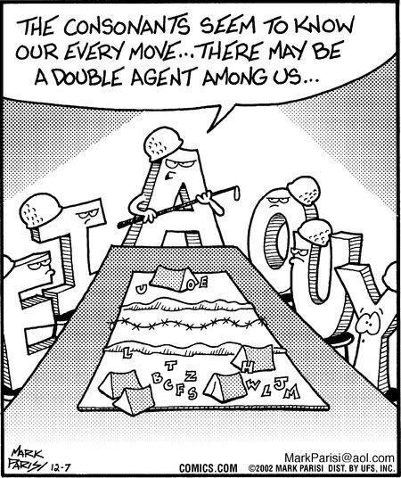

# Solution for Forwards From Grandma 

## Problem worth 100 points under Misc
## Statement:
My grandma sent me this email, but it looks like there's a hidden message in it. Can you help me figure it out?
(We are provided a download link for a .eml file)

## Solution:
Upon downloading the file, I opened it up using a text editor and was overwhelmed by its content. It contained a sweet ```thinking of you``` message from grandma and an attachment which was a base64 encoded jpg image (this made the file too large to read), but the most interesting part was the subject line, it looked something like this:
```
Subject: FWD: FWD: RE: FWD:  FWD: RE: FWD: FWD:  FWD: RE:  RE: RE: FWD: { FWD:
 FWD:  FWD: FWD: RE: RE: FWD: RE:  RE: RE:  FWD: FWD:  FWD: FWD: FWD:  FWD:
 FWD: FWD:  FWD: FWD: RE: RE: FWD: RE:  FWD: RE:  RE: RE: RE:  FWD: RE: FWD:
 FWD: } THIS IS HILARIOUS AND SO TRUE
```
 Those curly braces catch the eye of any seasoned flag hunter and thus I started tinkering around with the subject line. Upon a closer inspection I could see the repeating ```FWD:``` and ```RE:``` strings being nicely spaced out by two whitespaces every once in a while. So I broke up all of the chunks based on the two whitespaces. The new message looked something like this:
```
FWD:FWD:RE:FWD:  FWD:RE:FWD:FWD:  FWD:RE:  RE:RE:FWD: { FWD:FWD:  FWD:FWD:RE:RE:FWD:RE:  RE:RE:  FWD:FWD:  FWD:FWD:FWD:  FWD:FWD:FWD: FWD:FWD:RE:RE:FWD:RE:  FWD:RE:  RE:RE:RE:  FWD:RE:FWD:FWD: } 
```
The pattern of repeating ```FWD:```s and ```RE:```s made me think this might have something to do with morse code which is very close to this with its repeating ```.```s and ```-```s. So I replaced all the ```FWD:```s with ```.```s and all the ```RE:```s with ```-```s. The newly formed code looked something like this:
```
..-. .-.. .- --. { .. ..--.- -- .. ... ... ..--.- .- --- .-..}
```
Using [morse code decoder](https://morsedecoder.com/) I found the flag to be ```FLAG#I_MISS_AO#``` which translated to ```flag{I_MISS_AOL}```

Even after finding the flag I was really curious about the image in the message was, so I decided to figure it out as well and used an online base64 to image [converter](https://codebeautify.org/base64-to-image-converter). The image in the message was:

Indeed a very hilarious grandma joke :P